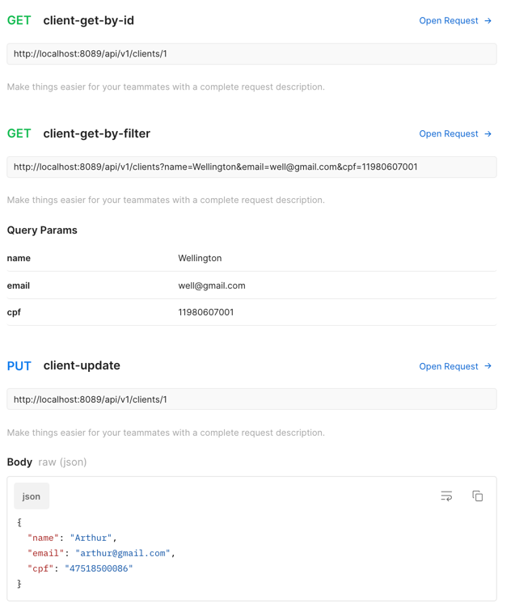
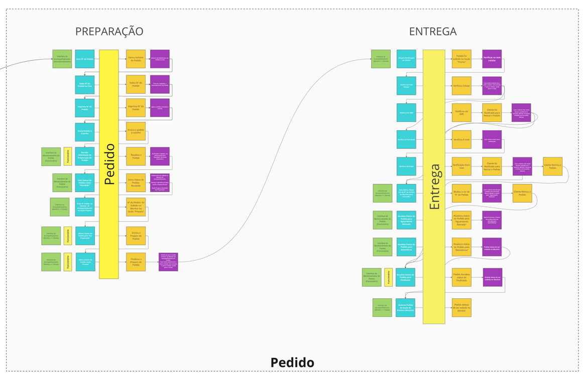
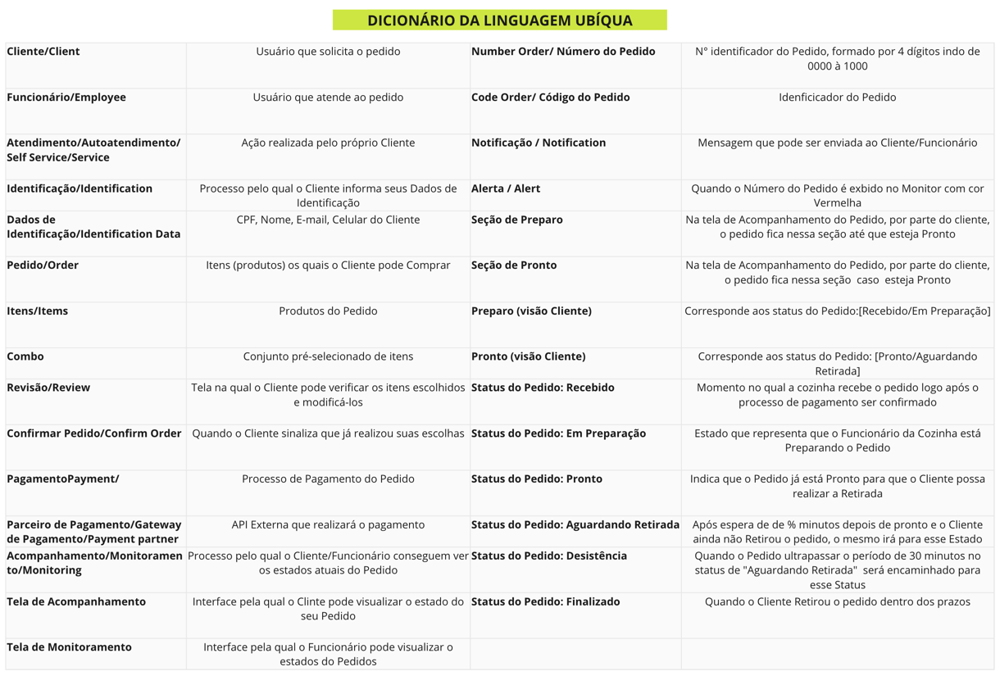

# tech-challenge-fiap-fase-01
Sistema de Gerenciamento de Pedidos - Lanchonete

##  Grupo 33
[Wellington da Silva Alencar](https://github.com/wellalencarweb) | rm353081

[Link do Projeto](https://github.com/wellalencarweb/tech-challenge-fiap-fase-01)

[Link do Event Storm](https://miro.com/app/board/uXjVNVCMJaU=/?share_link_id=723408841855)

[Link da Documentação da API](https://documenter.getpostman.com/view/2196561/2s9YysBgBA)

[Dockerfile](Dockerfile)

[docker-compose](docker-compose.yml)

## Stack utilizada
* PHP 8.2
* MySQL
* Laravel
* Docker

## Instalação
Para instalação é indispensavel ter `docker` e `docker-compose` instalado em sua máquina.

Clonar o Projeto `git clone https://github.com/wellalencarweb/tech-challenge-fiap-fase-01.git`
[Link do Projeto](https://github.com/wellalencarweb/tech-challenge-fiap-fase-01)

Exitem duas formas de subir o projeto:

1. Subir via instalador:
   1. Irá copiar `.env.example` para a raíz do projeto como `.env`
   2. Irá executar o `make build` (que fará a build do contâiner e a instalação das dependências) - isso pode levar um tempo
   3. Irá executar o `make migrate-fresh-seed` (que irá subir o Banco de Dados)
````bash
./install.sh
````
1. Subir via comandos:
   1. Copie o arquivo `.env.example` para a raíz do projeto renomendo como `.env`
   2. Esse projeto possui Makefile, para subir o container basta executar `make build` (irá demorar um pouco)
   3. Execute `make migrate-fresh-seed` para preencher o banco com as Migrations e Seeders

2. Ficará disponível no endereço [http://localhost:8089/](http://localhost:8089/), rodando na porta `:8089`
3. Acesse [http://localhost:8089/healthcheck](http://localhost:8089/healthcheck) para validar se a aplicação, variáveis de ambiente e Banco subiram corretamente

## Endpoints
Esta API fornece documentação no padrão Collection Postman. Portando basta importar o arquivo [tech-challenge-fiap-01.postman_collection.json](docs/tech-challenge-fiap-01.postman_collection.json) da pasta `\docs` em seu Postman.

Também é possível acessar o [Link da Documentação da API](https://documenter.getpostman.com/view/2196561/2s9YysBgBA)

Outra opção é fazer um Fork via:

[](https://app.getpostman.com/run-collection/2196561-2ff19fb3-449e-4c6b-b923-9a8ca88ec3b8?action=collection%2Ffork&collection-url=entityId%3D2196561-2ff19fb3-449e-4c6b-b923-9a8ca88ec3b8%26entityType%3Dcollection%26workspaceId%3D642a14ca-1f30-4733-8e0d-fc0a7e4b8392)

### Client
- Identificação do Cliente (pode ser somente com CPF; email e name, ou todos os campos)

  

- Obter dados do Cliente | Alterar o Cadastro

  

- Deletar Cliente

  

### Produto
- Cadastar Produtos | Listar Produtos por ID e Categoria

  

- Atualizar os Produto | Remover Produto

  

### Pedido
- Criação do Pedido | Listar os Pedidos
  
    

## Desenvolvimento do projeto

### Diagramas

Foram utilizadas técnicas de Domain Driven Design para definição dos fluxos:

- Identificação do Cliente e Início do Pedido

  

- Pagamento

  

- Preparação e Entrega

  

### Dicionário da Linguagem Ubíqua
- Dicionário

  

### Estrutura do Projeto
[Dockerfile](Dockerfile)

[docker-compose](docker-compose.yml)

O projeto foi reestruturado seguindo o padrão do Arquitetura Hexagonal e DDD.


```shell
.
├── src
│  ├── BoundedContext
│  │   ├── Client
│  │   │   ├── Aplication
│  │   │   ├── Domain
│  │   │   └── Infrastructure
│  │   ├── Order
│  │   │   ├── Aplication
│  │   │   ├── Domain
│  │   │   └── Infrastructure
│  │   ├── Product
│  │   │   ├── Aplication
│  │   │   ├── Domain
│  │   │   └── Infrastructure
```


